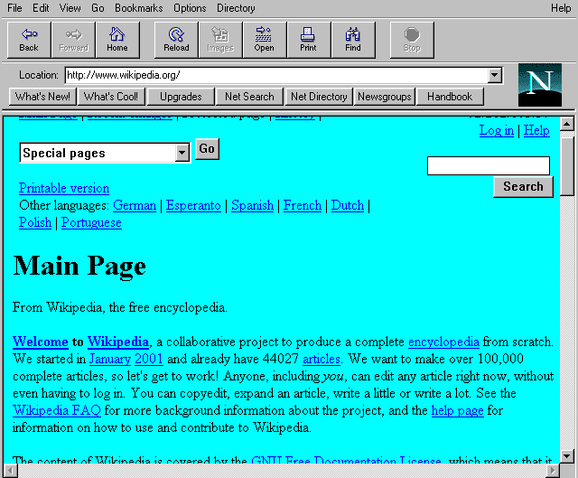

# 2.1 Resumo

## JavaScript

O JavaScript é uma linguagem de programação interpretada, conhecida também como linguagem de script em alto nível para páginas Web, sendo uma linguagem leve e multi-paradigma, consistindo as três tecnologias principais da World Wide Web.

Permitindo tornar as aplicações interativas, o JavaScript é uma parte essencial da web, compondo a grande maioria dos sites disponíveis e também ganhando um espaço dedicado do mecanismo dos principais navegadores acessíveis.

## História

Tudo nasceu com a Netscape, com a criação do Netscape Navigator,*Imagem 1*, que em pouco tempo o navegador mais dominante dessa década, logo chegou à conclusão que a web teria que se tornar mais dinâmica, pois o Navigator tinha sempre que fazer uma requisição ao servidor para obter uma resposta do navegador.

<center>
<br>



*Imagem 1 - Tela do Netscap Navigator.*
</center>
<br>

Em 1995 a Netscape contratou Brendan Eich para criar uma linguagem que proporcionasse esse dinamismo no navegador. A proposta inicial era a implementação da linguagem Scheme, baseada em LISP, puramente funcional, no Navigator. Porém a Netscape tinha projetos anteriores em conjunto com a Sun Microsystems para colocar sua mais recente e promissora linguagem de programação, o Java, no Navigator. Isso elevou uma discussão interna do motivo de ter duas linguagens.

Obviamente predominou a escolha de uma única linguagem com a sintaxe baseada em Java. O argumento foi que o Scheme, por ter uma sintaxe e complexidade características de linguagens funcionais, se tornaria impopular (conforme o código abaixo). O objetivo da Netscape com a nova linguagem era exatamente o oposto.

```
  (import
    (rnrs)
    (ironscheme clr))

  ;Define a function write-ln
  (define (write-ln fmt . args)
    (clr-static-call System.Console WriteLine (clr-cast System.String fmt)
      (clr-cast System.Object[]
        (list->vector args))))

  ; And invoke it!
  (write-ln "{0}" "Hello World!")
```

<center> 

*Código de exemplo da linguagem Scheme.*
</center>
<br>

Mesmo com sintaxe “javanesa” e com outras características do Java (valores primitivos e objetos), o JavaScript logo de início sofreu a influência funcional do Scheme, e mais tarde de linguagens como o Self (protótipos), Perl e Python (Strings, arrays e expressões regulares).

Para defender o JavaScript contra outras propostas, um protótipo foi criado por Eich em dez dias, em Maio de 1995. Marc Andreesen nomeou o protótipo de Mocha. O nome da linguagem mudou de novo para LiveScript por causa de patentes e porque vários produtos estavam levando o “Live” como sufixo. No começo de Dezembro de 1995, o Java estava no seu ápice e a linguagem foi renomeada para JavaScript.

### O ECMAScript

Depois que o JavaScript foi criado, a Microsoft criou, em Agosto de 1996, uma linguagem idêntica para ser usada no Internet Explorer 3. Para conter a ambição da Microsoft, a Netscape decidiu normatizar a linguagem através da organização ECMA International, companhia que era especializada em padrões e normativas.

Os trabalhos em cima da normativa ECMA-262 começaram em Novembro de 1996. O nome JavaScript já era patenteado pela Sun Microsystems (hoje Oracle) e não poderia ser usado. Portanto, o nome composto por ECMA e JavaScript foi usado, resultando em ECMAScript.

O ECMAScript esteve relativamente estagnado até 2015 com o aparecimento do *ECMAScript 6* - antes disso, o ECMAScript 3 foi publicado em 1999, o ECMAScript 4 foi abandonado, o ECMAScript 5 foi publicado em 2009 e o ECMAScript 5.1 foi publicado em 2011. 

O lançamento do ECMAScript 6 em 2015 marcou mudanças significativas para abordar os recursos exigidos pelo crescimento explosivo do JavaScript. E a velocidade das alterações de recursos foi tão grande que o ECMAScript 7 se tornou realidade em 2016 e o ​​ES8 em 2017. E hoje em dia temos o ECMAScript 11.

#### Por que isso é importante?

Porque você enfrentará constantemente situações em que o JavaScript comum é compatível com ES5 / ES5.1, ES6, ES7 ou ES8. 

Será JavaScript da mesma forma, mas não será executado em todos os mecanismos JavaScript, porque estes estão em constante fluxo para suportar diferentes versões do ES. A seguir, é apresentada uma lista dos principais mecanismos JavaScript e seu suporte a ES:

 - SpiderMonkey - Usado pelo navegador Firefox e Adobe Acrobat. Suporta ES5.1, recursos do ES6, ES7 e ES8.
 - V8 - Usado pelo navegador Google Chrome, Opera e Node.js. Suporta ES6 e recursos do ES7 e ES8.
 - WebKit - Usado pelo navegador Apple Safari. Suporta ES6 e recursos do ES7 e ES8.
 - Chakra - Usado pelo navegador Microsoft Edge. Suporta ES5.1 e recursos do ES6, além de alguns recursos do ES7.
