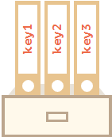

# 4.14 Objetos

## o que é um objeto?

É bem simples. Podemos imaginar um objeto como sendo uma gaveta, onde nessa gaveta existem pastas. Cada dado é armazenado em seu arquivo pela chave. Confira na figura a seguir:



A sintaxe de um objeto também é bem simples. Exemplo:
```javascript
let he4rt = {
    comunidade: "Ativa",
    devs: "Incríveis"
};
```
Nesse exemplo, temos o objeto "he4rt", onde as chaves desse objeto são "comunidade" e "devs". Essas chaves também podem conter outros objetos, funções etc.

Também é possível criar um objeto vazio através do "object constructor". Exemplo:
```javascript
let user = new Object();
let user = {}
```

Para adicionar porteriormente uma key num objeto já criado, basta usar o ponto (.). Exemplo:
```javascript
let he4rt = {
    comunidade: "Ativa",
    devs: "Incríveis"
};
console.log(he4rt) // {comunidade: "Ativa", devs: "Incríveis"}
// ADICIONANDO UMA NOVA KEY
he4rt.key = "adicionada"
console.log(he4rt) // {comunidade: "Ativa", devs: "Incríveis", key: "adicionada"}
```

Outra forma de adicionar objetos, é usando []. Exemplo:
```javascript
let he4rt = {
    comunidade: "Ativa",
    devs: "Incríveis"
};

he4rt["nome"] = "Vitor"

console.log(he4rt) // {comunidade: "Ativa", devs: "Incríveis", nome: "Vitor"}
```

Agora que conseguimos declara-los em hard code, um vazio, e adicionar uma chave em um objeto já declarado, como remover? Exemplo:
```javascript
let he4rt = {
    comunidade: "Ativa",
    devs: "Incríveis"
};
console.log(he4rt) // {comunidade: "Ativa", devs: "Incríveis"}

delete he4rt.devs;
console.log(he4rt) // {comunidade: "Ativa"}
```

### Acessando objetos

Agora que conseguimos manipular a criação e como deletar chaves num objeto, como podemos imprimir a frase "Hello World" usando duas keys dentro de um objeto? Simples.

```javascript
let helloWorld = {
    hello: "Hello ",
    world: "World"
}

console.log(helloWorld.hello + helloWorld.world) // Hello World
```
Aqui, estou dizendo para. entrar em "helloWorld" e acessar "hello." Dessa forma, o "console.log" conseguiu imprimir a string da chave.

[Proximo Capitulo](../5_DOM-DocumentObjectModel/1_Introducao.md)