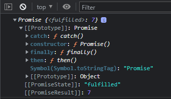
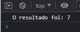
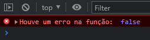

# Promise

As Promises ou Promessa traduzido para o português, é nada mais que um objeto javascript que sempre retorna um resultado seja de sucesso ou erro.

### Funcionamento da promise

A promise sempre irá retornar um resultado independente se for de sucesso ou erro, e ainda assim é possível definir o que irá retornar em caso de sucesso ou em caso de erro. Vamos ver na prática para entendermos melhor.

Eu tenho uma função que a partir de dois parâmetros soma e retorna o calculo.

```
function calcular(soma1, soma2) {
    return soma1 + soma2;
}
```

A partir do resultado da função de `calcular()` eu quero decidir se será retornado o resultado da função ou então caso ocorra um erro o que seria retornado. Sendo assim, criaremos uma variável que receberá o resultado dessa promise.

```
const promise = new Promise(function (resolve, reject) {
    const soma1 = 2;
    const soma2 = 5;

    const result = calcular(soma1, soma2);

    if (result != null) {
        resolve(result);
    } else {
        reject(false);
    }
});
```

Dentro da promise será criado uma função de callback onde deverá ter dois parâmetros, sendo eles o `resolve` eo `reject`. O resolve irá retornar tudo o que for referente a uma operação bem sucedida, já o reject se refere a uma operação que houve falha. Neste exemplo podemos ver que eu crio duas variáveis (`soma1` e `soma2`), atribuo um valor a elas e então é criado outra variável para receber o resultado da função `calcular()`.
A partir do resultado obtido na variável `result` será feita uma validação para definir se houve um valor de fato ou não, caso haja o `resolve` será acionado retornando assim o valor que estiver na variável `result`, caso não haja valor nenhum o reject será acionado retornando false.

> Lembrando os valores no `resolve` e no `reject` eu defini desta maneira, você por sua vez poderá retornar o que fizer mais sentido no seu caso.

Depois de ter criado a promise e definido os retornos que a mesma dará ainda não acaba por ai, pois o resultado da variável `promise` que haviamos definido para receber o resultado da promise também terá um retorno em um objeto promise. Se colocarmos a variável em um console.log será possível perceber que é retornado esse objeto promise.

```
console.log(promise)
```

Valor na variável `promise`



Então, o que poderá ser feito para obter o resultado destá promise? Precisamos utilizar os métodos `then()` e `catch()`!

> Caso você nunca tenha visto sobre [then()](https://developer.mozilla.org/en-US/docs/Web/JavaScript/Reference/Global_Objects/Promise/then) e [catch()](https://developer.mozilla.org/en-US/docs/Web/JavaScript/Reference/Global_Objects/Promise/catch) é possível verificar na MDN Web Docs.

Para que possamos obter o resultado da promise é bem simples!

`````
// Variável promise
promise
    .then(function (result) {
        console.log(`O resultado foi: ${result}`); // Resultado da função ````calcular()```
    })
    .catch(function (error) {
        console.error("Houve um erro na função: ", error); // Resultado obtido na promise, no nosso caso será "Houve um erro na função: { error }"
    });
`````

Ambos os métodos `then()` e `catch()` necessitam de uma função de callback, sendo assim criamos uma função de callback em cada método passando um parâmetro que no caso do `then()` retornada o resultado e no caso do `catch()` retornará o erro.

Agora vamos ver como ficaria o código completo.

### Código completo

```
function calcular(soma1, soma2) {
    return soma1 + soma2;
}

const promise = new Promise(function (resolve, reject) {
    const soma1 = 2;
    const soma2 = 5;

    const result = calcular(soma1, soma2);

    if (result != null) {
        resolve(result);
    } else {
        reject(false);
    }
});

promise
    .then(function (result) {
        console.log(`O resultado foi: ${result}`);
    })
    .catch(function (error) {
        console.error("Houve um erro na função: ", error);
    });
```

### Resultados

Esperamos que se ocorrendo tudo da forma esperada seja retornado a soma das variáveis `soma1` e `soma2`, sendo no total 7. Então deverá ser retornado da seguinte forma: "O resultado foi: 7".



Mas e se eventualmente ocorrer um erro o que deverá ser retornado? Para isso irei provocar um erro para mostrar o resultado.
Neste caso irei na função `calcular()` e alterar para retornar somente `null`.

```
function calcular(soma1, soma2) {
    return null;
}
```

Então o retorno para este caso será:



[Proximo Capitulo](../5_DOM-DocumentObjectModel/1_Introducao.md)
