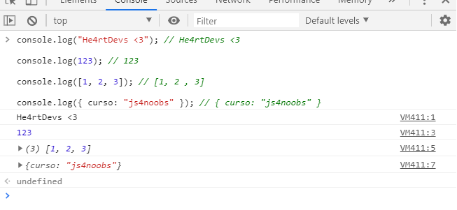

# 4.1 - Funções de Saída

Após o nosso ambiente montado com todas as ferramentas necessárias, vamos agora ver um código na prática.

Como iremos usar o nosso console em uma boa parte do curso, precisaremos de algumas funções para nos auxiliar a visualizar qualquer saída de dados do nosso código. Nessa lição, iremos conhecer essas funções.

## Função -> Console.log()

Descrição: Exibe uma mensagem no console do navegador.

Sempre que fizermos um trecho de código, precisamos entender se ele funcionou ou não.
Na maior parte do tempo, iremos usar o `console.log()` para fazer essa verificação.
Utilizando essa função, a mensagem, variável ou o que quisermos, será impresso no console.

Veja este primeiro exemplo:

```js
console.log("He4rtDevs <3");

console.log(123);

console.log([1, 2, 3]);

console.log({ curso: "js4noobs" });
```

Saída rodando o código no NodeJS:

```
He4rtDevs <3
123
[1, 2, 3]
{ curso: "js4noobs" }
```

A saida rodando o código no navegador:

<p align="center">
  
</p>
<center>
  Imagem 1 - Tela do navegador chrome, utilizando o console.
</center>

### Algumas observações:

Como é possível notar, o `console.log()` automaticamente faz uma quebra de linha após fazer uma impressão.

É interessante notar também que quando passamos um array (no caso o `[1,2,3]`), os valores são impressos dentro dos colchetes, reforçando que é um array. No caso de visualizar no console do browser ainda é possível clicar naquela setinha que está à esquerda no começo da linha para expandir as informações do array.

Algo semelhante ocorre quando passamos um objeto (no caso o `{ curso: "js4noobs" }`), os campos são impressos dentro de chaves, reforçando que aquelas informações fazem parte de um objeto. Novamente, visualizar no console do browser também traz vantagens, pois é possível clicar naquela setinha que está à esquerda no começo da linha para expandir as informações do objeto.

## Outras funções do Console

### Assert

Descrição: Escreve uma mensagem de erro para o `console` caso a expressão passada como primeiro argumento resulte em `false`. Case resulte em `true`, nada acontece.

```js
const boolean = false;
console.assert(boolean, "mensagem a ser exibida se o boolean for falso");
```
Saída:

```
mensagem a ser exibida se o boolean for falso.
```

No caso acima, usamos uma simples variável contendo um valor booleano, mas poderia ser uma expressão mais complexa, por exemplo:

```js
console.assert((5 + 4) > 8, "mensagem a ser exibida se o boolean for falso");
```

Nesse caso, nada será impresso, afinal, 9 é maior que 8 e o primeiro argumento receberá o valor `true`.

### count

Descrição: Exibe no console o número de vezes em que a chamada `count()` em particular foi invocada.

```js
let label = "";

function consoleLabel() {
  console.count(label);
  return "label: " + label;
}

label = "he4rt";
consoleLabel();
label = "devs";
consoleLabel();
consoleLabel();
console.count();
```

Saída:

```
he4rt: 1
devs: 1
devs: 2
devs: 3
```

### dir

Descrição: Exibe uma lista interativa das propriedades do objeto JavaScript especificado. A saída é apresentada como uma lista hierárquica com triângulos que permitem ver o conteúdo de objetos-filho.

```javascript
const comunidade = {
  nome: "he4rt",
};

console.dir(comunidade);
```

Saída no NodeJS:

```
nome: 'he4rt';
```

Saída no browser:

```
▶ Object
```

Caso clique no triângulo:

```
▼ Object
    nome: "he4rt"
  ▶ __proto__: Object

```

### error & exception

Descrição: 'Escreve' uma mensagem de erro no Web Console.

```js
console.error("Erro aqui irmão!");
// Erro aqui irmão!

Descrição: Um atalho para o `error`.

console.exception("Erro aqui irmão! mas de outra forma");
// Erro aqui irmão! mas de outra forma
```

### group

Descrição: cria e separa as mensagens em grupos alinhados.

```js
console.log("Canais do discord");
console.group();
console.log("global");
console.group();
console.log("bate-papo");
console.log("aprendizado-diário");
console.groupEnd();
console.groupEnd();

// Canais do discord
// | global
// | | bate-papo
// | | aprendizado-diário
```

## table

Descrição: Exibe as informações em forma de tabela.

```js
console.table(["he4rt", "devs", "discord"]);
```

Saída:

| (index) | Values  |
| ------- | ------- |
| 0       | he4rt   |
| 1       | devs    |
| 2       | discord |

Para mais informações e usos, confira a [documentação do console.table()](https://developer.mozilla.org/pt-BR/docs/Web/API/Console/table).

## Time & TimeEnd

Descrição:
`time()` Inicia um cronômetro com precisão de milisegundos.

`timeEnd()` termina e exibe a contagem do tempo.

```js
console.time();
for(let i = 0; i < 10; ++i) {
    // alguma ação
};
console.timeEnd();
```

Saída:

```
default: 0.00830078125ms
```

Note que esse tempo cronometrado é só um exemplo, você provavelmente irá receber um valor diferente na sua máquina caso rode o código acima sem alterações.

Note também que o valor cronometrado recebeu o nome de "default", isso pode não ser muito útil, então é interessante que a gente dê um nome quando usarmos essa função:

```js
const label = 'for vazio';

console.time(label);
for(let i = 0; i < 100; ++i) {
};
console.timeEnd(label);
```

Saída:

```
for vazio: 0.030029296875ms
```

### warning

Descrição: Escreve uma mensagem de alerta no Console Web.

Usado para mostrar mensagens de erro para o usuário pelo console.

```js
console.warn("Texto de alerta!");
```

Saída:

```
Texto de alerta!
```

Caso rode no browser, note que a linha onde é impresso o texto toma a cor amarela.
